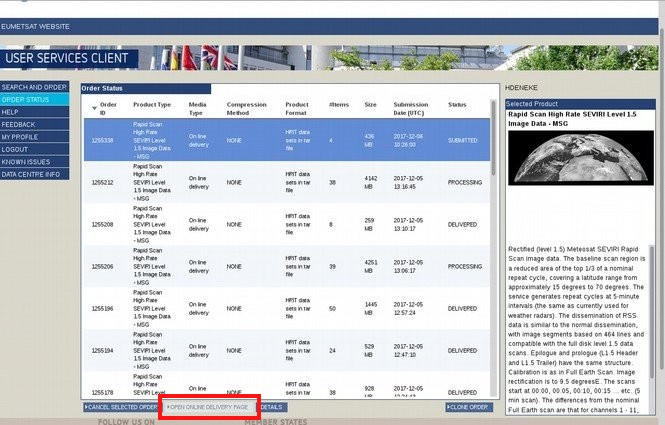
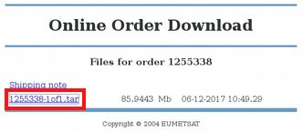

# Copy Data from HTTP



### 1. Go to **Order Status** select your delivered order and **Open Online Delivery Page**.



### 2. Download file(s) from the delivery page using **Right Click + "Save file under..."**

Please check, if the downloaded file is as big as given in the delivery
page and that the archive contains as many slots as intended. If not, download again.

### 3. Move files from your local system to the *talos* server:

```
cd Downloads

mv 1234567-1of1.tar /vols/talos/home/group_share/misc_documents/sat_archive_filling
```

### 4. Log onto server altair as user "sat_data" with:

```
ssh -X sat_data@altair
password: **Please ask**
```

### 5. Move the file from talos to altair:

```
cd /vols/altair/datasets/eumcst/incoming/umarf/http/(year)

mv /vols/talos/home/group_share/misc_documents/sat_archive_filling/*.tar /vols/altair/datasets/eumcst/incoming/umarf/http/(year)
```

### 6. Extract your order:

```
tar -xvf 1234567-1of1.tar
```
