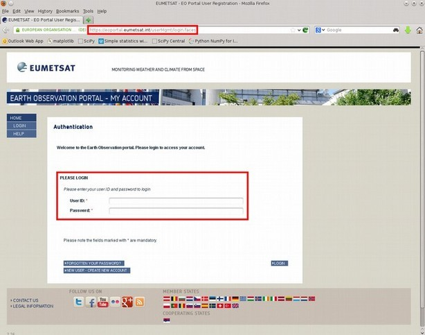
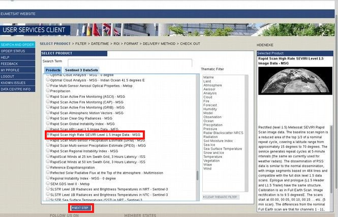
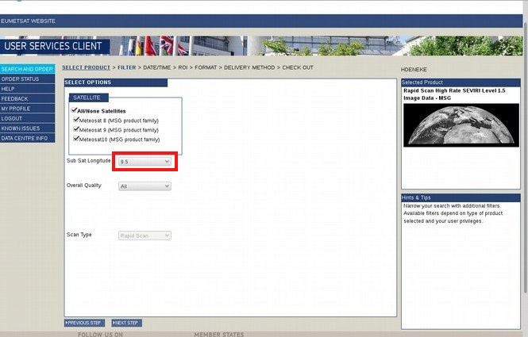
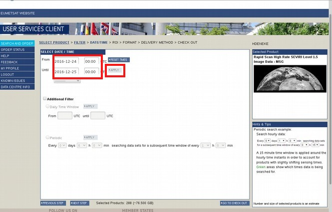
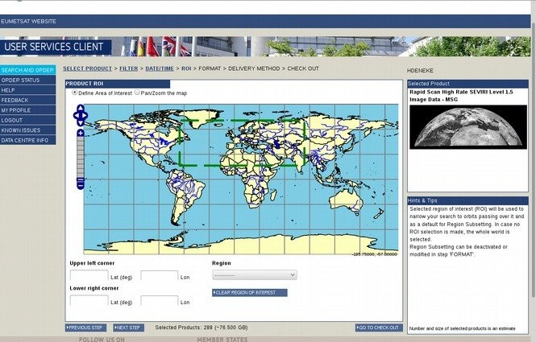
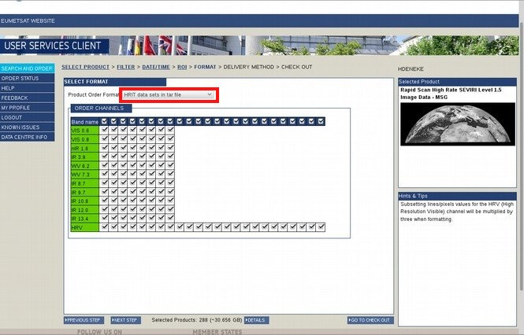
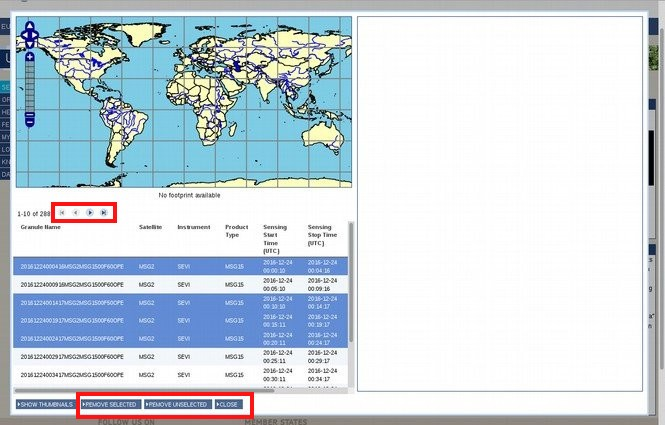
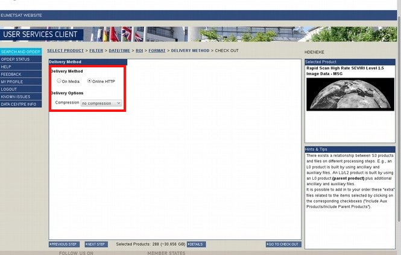
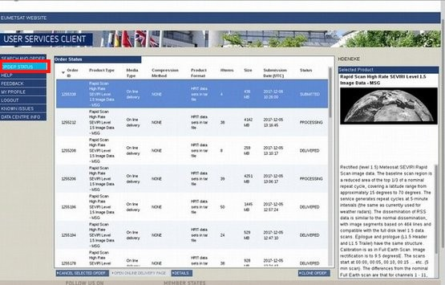

# Ordeting Data

## Ordering data from the EUMETSAT archive

### 1. Log in to [https://eoportal.eumetsat.int](https://eoportal.eumetsat.int/) with:



```
username: hdeneke
password: ******
```

### 2. Start the data centre application using **Access** under **Data Centre**.


### 3. Select your data type from the data center product list, then go on with **next step**:



* For **Prime-Service** (PZS) use: _"High Rate SEVIRI Level 1.5 Image Data -- MSG -- 0 degree"_
* For **Rapid-Scan-Service** (RSS) use: _"Rapid Scan High Rate SEVIRI Level 1.5 Image Data -- MSG"_
* For **Prime-Service over Indian Ocean** use: _"High Rate SEVIRI Level 1.5 Image Data -- MSG -- Indian Ocean 41.5 degrees E"_

### 4. Double-check if the required longitude in **Sub Sat Longitude** is correct:



* 0° for the Prime-Service (PZS)
* 9.5° for the Rapid-Scan-Service (RSS)
* 41.5° for the Indian Ocean

### 5. Select the required period of time in the **Select Date / Time** field. Get results with **Apply** (might take a while).



* a maximum of **three months** for Prime-Service (PZS)
* a maximum of **one month** for Rapid-Scan-Service (RSS)

### 6. Skip the selection of regions using **Next Step**.



### 7. Select product order format as "**HRIT data sets in tar file**". Then click next step.



### 8. Go to **Details**, which on the right to **next step**.



Use ◄ and ► to browse through the selected period of time and use **CTRL + Left Click** to select the slots you want. If you are done with
the selection use **Remove Unselected** to clear all unwanted slots from your list. Double-check if no slot is missing. Use "Close" if everything
is correct.

### 9. Choose the **Delivery method** which is suitable for the data:



→ "Online HTTP" if the order is **bigger than 80 GB**

→ "On Media" if the order is **less than 80 GB**

By delivery option **no compression** is fine because the data files are already compressed.

### 10. Go the last step, where only the overall data size is presented.


Finally send the order with "Place your order".

### 11. Note the order number at our wiki:

[http://wiki-intern.tropos.de/index.php/EUMETSAT_Data_Ordering_Diary](http://wiki-intern.tropos.de/index.php/EUMETSAT_Data_Ordering_Diary)



### 12. Click at **ORDER STATUS**. It shows the order number and the status of the order. Several status are possible:

* Pending (order still not submitted),
* Submitted (order is submitted),
* Cancelled (order is cancelled),
* Processing (order is en route),
* Delivered (order is delivered),
* Error (order went wrong)
